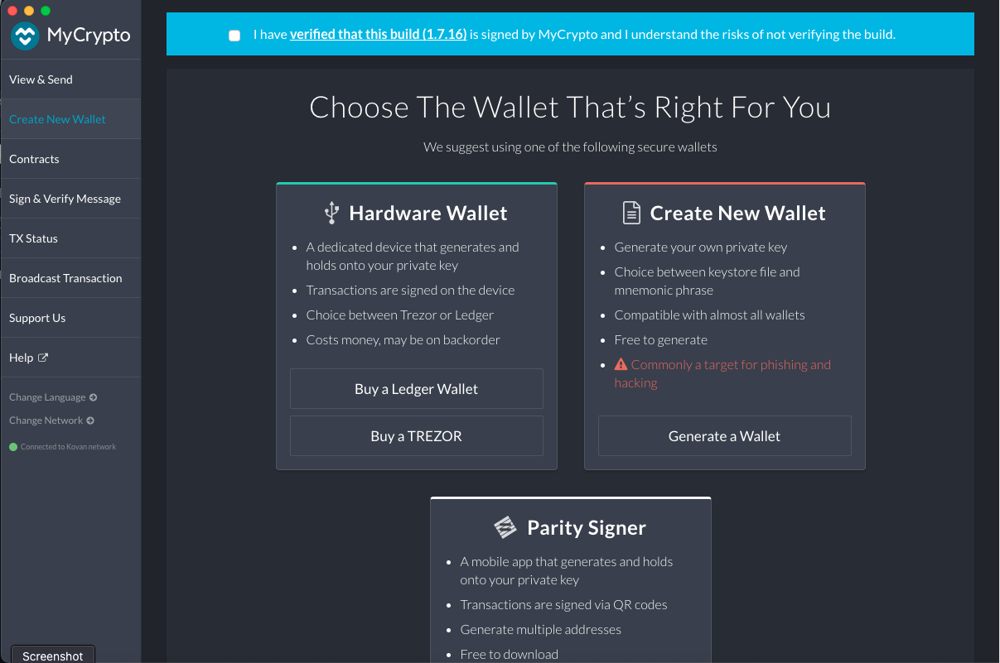

# Neonet-Blockchain
### Instructional guide for setting up and using the private testnet 

In order to start using the testnet you will need to take the following steps:

- Download the MyCrypto desktop app at https://mycrypto.com 

- Open the MyCrypto app and select "Create New Wallet then click on "Generate a Wallet" 

- Select Generate a Mnemonic Phrase and make a note of this phrase, you will need this to access you wallet. Note: Do not store this phrase anywhere online including cloud services and do not copy this to you clipboard.
- Confirm the phrase
- You will need to click on each word in the order that they are in within you mnemonic phrase
- Follow the steps below to unlock your wallet

- Next download and install geth by navigating to the Go Ethereum Tools website https://geth.ethereum.org/downloads/

- Download the lastest stable release

# Setting Up the Network

1. Open the terminal
2. Change directory into the folder you installed Go Ethereum
3. Type ./puppeth into the terminal

4. Follow the prompts as listed below

5. Next open another terminal window and change directory into the folder you installed geth in.

6. Using ./geth initialize both nodes as follows:
- ./geth --datadir node-1 init neonet.json
- ./geth --datadir node-2 init neonet.json

7. Open two new terminal windows and run the following commands:

- ./geth --datadir node-1 --unlock "F1EF32FaA13c3aD67F4bb45216C2d8966d0bfAf3" --mine --rpc --allow-insecure-unlock

- ./geth --datadir node-2 --unlock "E8B971aEa028bb46E6580B5DFa959B4cef26FA40" --mine --port 30304 --bootnodes "enode://F1EF32FaA13c3aD67F4bb45216C2d8966d0bfAf3@127.0.0.1:30303" --ipcdisable --allow-insecure-unlock

8. Type in the password provided by the admin

9. Open MyCrypto and select Change Network

10. Click on Add Custom Node and enter in the information as listed below:

- Then network name is neonet
- The currency is ETH
- The chain id is: 3232
- The URL is https://127.0.0.1:30303

